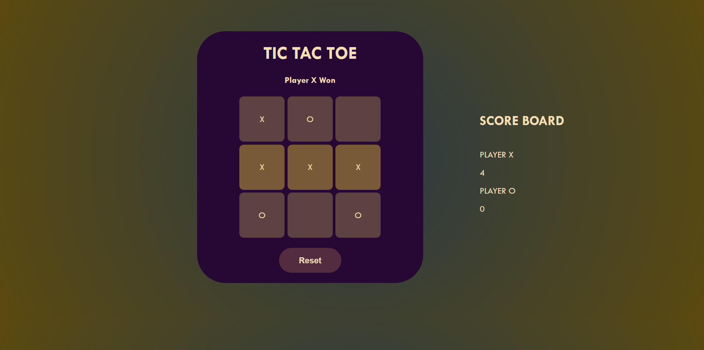

# 🎮 Tic Tac Toe Mini Project

A simple, responsive **Tic Tac Toe game** built using **HTML**, **CSS**, and **Vanilla JavaScript** (no frameworks).

---

### ✅ Features:
- Player vs Player Mode
- Real-Time Score Tracking
- Highlight Winning Cells
- Clean, Stylish UI with subtle transitions
- Responsive Design (Mobile-Friendly)

---

### 📸 Screenshot

---

### 🚀 Live Demo

👉 [Click to Play the Game](https://s-d-13.github.io/tic-tac-toe-game/)

---

### 🛠️ Tech Stack

- HTML5  
- CSS3  
- Vanilla JavaScript

---

### 👤 Author

[@s-d-13](https://github.com/s-d-13)
